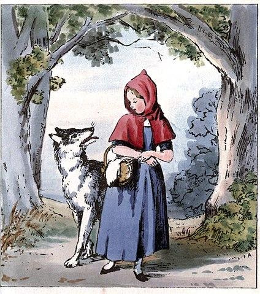

# El Lobo Feroz

### Pautas para la resolución del ejercicio
Desarrollar la solución en los archivos:
- caperucita.wlk
- feroz.wlk

No realizar cambios en los nombres de los archivos, ya que las correcciones solo tienen en cuenta los objetos modelados en los mismos. 
Respecto a los nombres de objetos y nombres de mensajes a utilizar en el modelado, remitirse al **glosario** de "nombres obligatorios" que está al pie de este documento (respetar mayúsculas y minúsculas). Tener en cuenta que los métodos SIEMPRE tienen paréntesis, y a veces pueden tener parámetros y otras veces no. Si en la solución no se utilizan los nombres indicados en el glosario, los test de las correcciones no funcionarán y restan puntos de la calificación. Tener en cuenta que pueden definir métodos y objetos auxiliares de ser necesario, pero los que figuran como obligatorios si o si tienen que existir para que corran los test, y deben cumplir la funcionalidad correcta.

---

### Enunciado
Feroz, el lobo, se siente desnutrido y famélico y quiere un sistema para simular sus actividades diarias. Quiere mejorar su estado de salud, comiendo saludable y a la vez haciendo ejercicio para no excederse en su peso. 

## Requerimientos básicos de feroz:

- Averiguar si feroz está saludable, lo que se deduce de que su peso esté entre 20 y 150 unidades. Se sabe que inicialmente pesa 10 unidades, por lo que no está saludable.

- Que al lobo sufra una crisis que lo hace volver a su peso inicial. 

- Cuando feroz come algo su peso aumenta un 10% del peso ingerido. Por ejemplo, si se come una hamburguesa que pesa 20 aumenta 2. 

2. Cuando feroz va corriendo hasta un lugar, su peso disminuye 1 unidad, independientemente del lugar que sea. 

## Caperucita Roja, la abuelita y el cazador:

3. Por otra parte, está Caperucita, que pesa 60 y lleva una canasta con manzanas. Inicialmente en la canasta hay 6 manzanas (todas del mismo peso: 0.2) pero podría ser que dicha cantidad disminuya. Entonces el peso de caperucita es el suyo propio más lo que pesan las manzanas. Su abuelita pesa siempre 50. 

4. Representar las siguientes versiones de la historia del lobo Feroz (cada una en un objeto separado, que entienda el mensaje **transcurrir**):
- historiaFeliz:
    - El lobo va corriendo hasta el bosque. Allí se encuentra con Caperucita, conversan, pero no pasa nada más. Luego, el lobo corre a la casa de la abuelita y luego de comersela, se disfraza de ella.  Mientras tanto, Caperucita cruza el bosque y se le cae una manzana de su canasta. Cuando feroz ve llegar a Caperucita a la casa, molesto por las preguntas incisivas sobre su aspecto físico, abre grande su boca y se come a Caperucita con canasta y todo. Finalmente, llega el cazador y a feroz le provoca una crisis, por lo tanto feroz devuelve a caperucita y a la abuelita al mundo de los vivos. ¿cuanto pesa ahora feroz? ¿está saludable?
- historiaNoFeliz: 
    - El lobo corre a casa de la abuelita. Se come a la abuelita. Luego llega caperucita y también se come a caperucita. A continuación llega el cazador, que pesa 90kg, y el lobo también se come al cazador. ¿estará saludable ahora? ¿cuando pesa ahora feroz?

---

### Glosario de nombres de objeto y mensajes obligatorios

- feroz
- caperucita
- abuelita
- cazador
- historiaFeliz
- historiaNoFeliz
- estaSaludable()
- peso()
- perderUnaManzana()
- correr()
- comer(algo)
- sufrirCrisis()
- transcurrir()